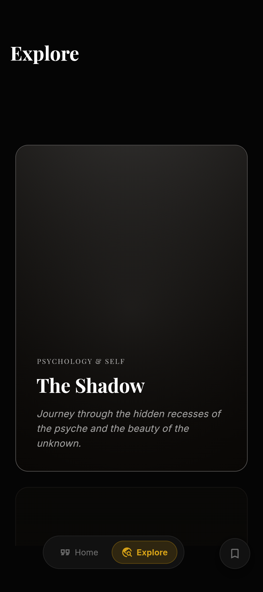
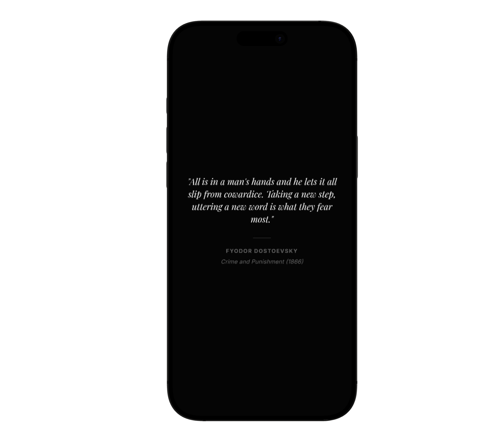
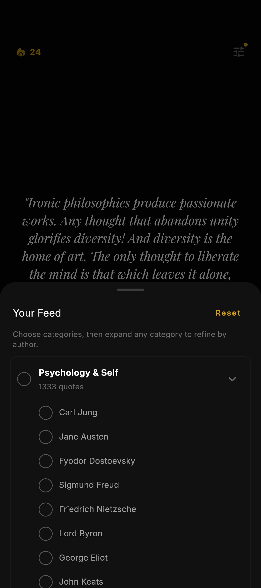
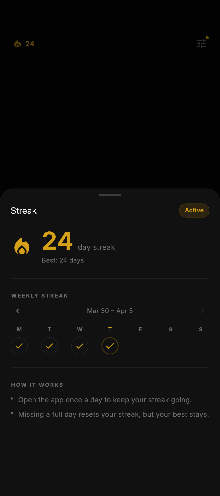

# Quotesy
Curated human wisdom in a focused, dark-academia inspired Flutter experience.

## Screenshots





## Overview
Quotesy is a quote discovery and reading app with a deliberate, minimalist UI. The content is curated through an AI-editorial pipeline so that each quote is authentic, meaningful, and high quality. The experience favors depth over volume: fewer distractions, more reflection.

## Features
- Curated library of 5,420 quotes across 6 categories
- Infinite swipe feed for uninterrupted reading
- Explore view with reactive lighting and scroll-aware focus states
- Bookmarks vault with fast lookup by quote id
- First-run import that converts JSON assets into Hive for fast access

## Technical Stack
- Flutter
- Riverpod 3
- Hive local database
- GoRouter navigation
- Google Fonts (Playfair Display for quotes, Inter for UI)

## How It Works
1. On first launch, the app transforms the JSON asset into a Hive box using a background isolate for a smooth startup.
2. Quotes are indexed by a unique `id` for O(1) access.
3. The Explore UI uses layered gradients and scroll-position driven opacity to create a subtle lighting effect.

## Project Structure
```
lib/
├── models/      # Data entities and Hive adapters
├── services/    # Database and import logic
├── providers/   # Riverpod state and initialization
├── routes/      # GoRouter configuration
├── screens/     # Page-level widgets
├── widgets/     # Reusable UI components
└── theme/       # Colors, typography, and theme
```

## Assets
- Quotes data: assets/quotes.json
- Fonts: assets/fonts/
- Screens: assets/explore.png, assets/quote.png, assets/filter.png, assets/streak.png

## Getting Started
1. Install Flutter and set up your environment.
2. Run `flutter pub get`.
3. Launch with `flutter run`.

## Roadmap
- Expand onboarding and streak experience
- Add more curated collections and seasonal themes
- Improve search and filtering options
